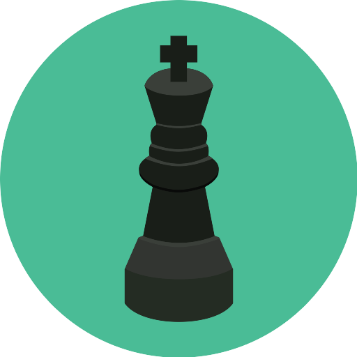

# **chessy** &nbsp; 

multiplayer real-time **chess** game uses [node.js](https://nodejs.org/en/), [React](https://reactjs.org/) [Web-Socket/ws](https://github.com/websockets/ws), [firebase](https://firebase.google.com/) and [material-ui](https://material-ui.com/)  

# **demo**

you can visit the https://realtime-chess-24c56.firebaseapp.com/

# **How it works** :

I will explain how the system of the game works in order to understand the code. using UML charts.

## **_state diagram_**:

This diagram shows the states of users and transitions between the states.  

## **_sequence diagram_**:

I translate the states diagram into sequence diagram **this will give a better overview**

-   ## offline --> online:

    when user register to the system. 
    

-   ## online --> play:

    when user register to the system. 
    

-   ## play --> offline/online:
    when user register to the system. 
    
